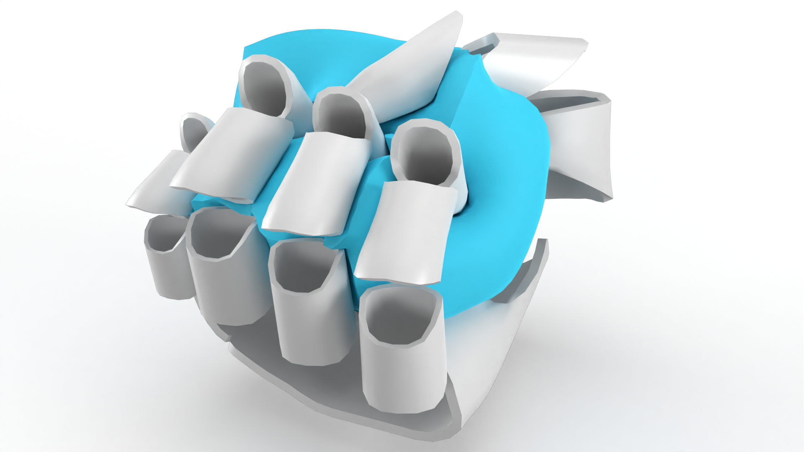
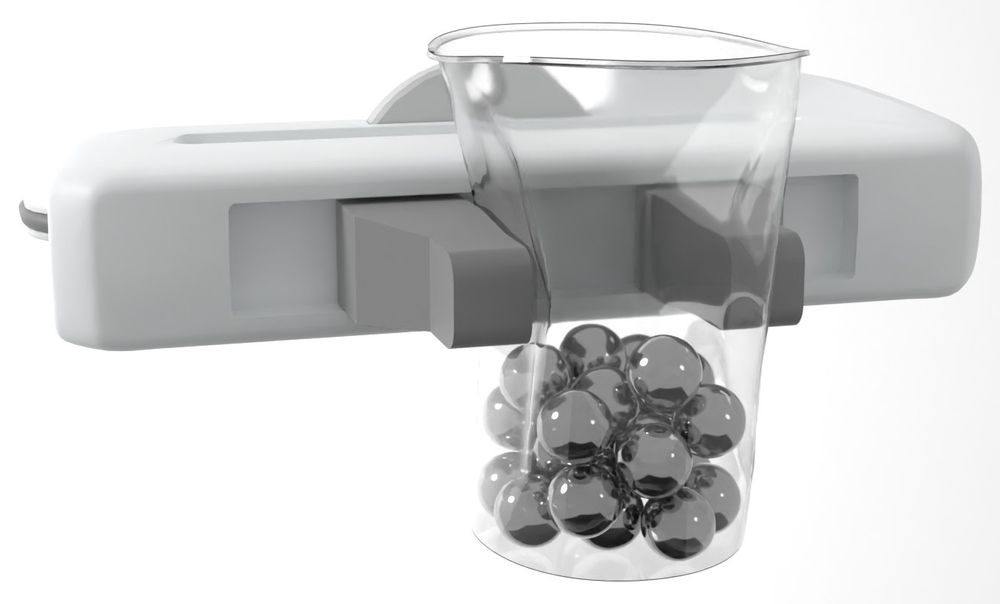
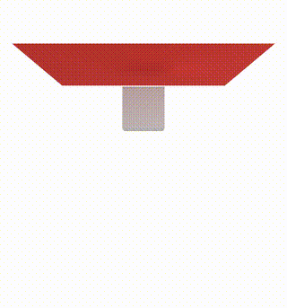
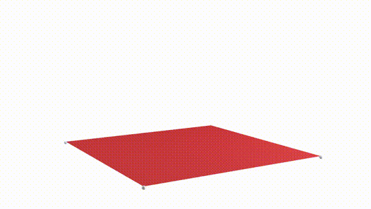
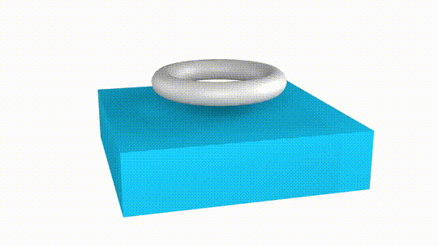

**Note:** This repository is a *work in progress*. 
More documentation, examples, tutorials, etc. will be coming as the rest of our responsibilities permit. 
In any case, Stark itself is fully functional and actively used in our own research.
We appreciate your patience and interest.

# Stark
<p align=center>
 
  &nbsp;&nbsp;
 
</p>

Stark is a C++ and Python simulation _platform_ that provides easy access to state-of-the-art methods to robustly solve simulations of rigid and deformable objects in a strongly coupled manner.
To the best of our knowledge, no other existing open source simulation environment provides such a rich collection of models, including coupling, with the same level of robustness.
Stark has been validated through real-world, challenging cases of interactions between robots and deformable objects, see the [Stark ICRA'24 paper](https://www.animation.rwth-aachen.de/publication/0588/).

One of the main features of Stark is that it uses a powerful symbolic differentiation and code generation engine that allows for a concise formulation of the global variational form of the non-linear dynamic problem.
Adding new models (e.g. materials, joints, interactions, ...) in Stark is as simple as specifying their energy potential in symbolic form together with the data they depend on.
This removes the tedium of manually deriving, implementing, testing and optimizing new models and integrating them in existing complex simulation environments.
Stark collects all the potentials and uses Newton's Method to find the solution to the non-linear implicit time-stepping problem.
Presently, even though Stark has a C++ and Python API, models can only be defined in C++.

By default, Stark comes out-of-the-box with important widely used models:
- 3D and 2D **FEM** discretizations for deformable non-linear materials
- **Discrete Shells** for cloths and stiff shells
- **Rigid Bodies** with joints and motors
- Frictional Contact with **IPC**

See [Features](#features) section for more details.

There are two use cases for Stark:
  - As an external, black-box, powerful simulator that can handle very challenging scenarios.
  No knowledge of Stark internals are needed in this case, and users can directly use the high-level C++ or Python APIs.
  - As a research and development tool for simulation.
  Thanks mainly to the symbolic differentiation and integrated collision detection, Stark can dramatically increase productivity of simulation technology research.
  See [here](stark/src/models) how the models contained in Stark are implemented.


## Hello World
The following is a script example using Stark's Python API to execute a simulation of a piece of cloth falling on a rigid box with a prescribed spinning motion.

<p align=center>
 
</p>

```python
import numpy as np
import pystark

settings = pystark.Settings()
settings.output.simulation_name = "spinning_box_cloth"
settings.output.output_directory = "output_folder"
settings.output.codegen_directory = "codegen_folder"
simulation = pystark.Simulation(settings)

# Global frictional contact IPC parameters
contact_params = pystark.EnergyFrictionalContact.GlobalParams()
contact_params.default_contact_thickness = 0.001  # Can be overriden by per-object thickness
contact_params.friction_stick_slide_threshold = 0.01
simulation.interactions().contact().set_global_params(contact_params)

# Add deformable surface
cV, cT, cH = simulation.presets().deformables().add_surface_grid("cloth",
    size=np.array([0.4, 0.4]),
    subdivisions=np.array([20, 20]),
    params=pystark.Surface.Params.Cotton_Fabric()
)

# Add rigid body box
bV, bT, bH = simulation.presets().rigidbodies().add_box("box", mass=1.0, size=0.08)
bH.rigidbody.add_translation(np.array([0.0, 0.0, -0.08]))
fix_handler = simulation.rigidbodies().add_constraint_fix(bH.rigidbody)

# Set friction pair
cH.contact.set_friction(bH.contact, 1.0)

# Script
duration = 10.0
def script(t):
    fix_handler.set_transformation(
        translation=np.array([0.0, 0.0, -0.08 - 0.1*np.sin(t)]), 
        angle_deg=100.0*t, 
        axis=np.array([0.0, 0.0, 1.0]))
simulation.add_time_event(0, duration, script)

# Run
simulation.run(duration)
```

The output is a sequence of VTK files per output group (in this case one sequence for the cloth and another for the box).
VTK files can be viewed in Blender with [this](https://github.com/InteractiveComputerGraphics/blender-sequence-loader) add-on or in [Paraview](https://www.paraview.org/).
You can use [meshio](https://github.com/nschloe/meshio) to transform VTK meshes to other formats.

Stark code will always follow the same structure:
  - Define global settings and parameters.
  - Add objects, boundary conditions and define interactions. In this example, `presets` are used but custom objects and composed materials are also possible.
  - Optionally, specify time-dependent events (script).
  - Run.
    
See the folder [`stark/pystark/examples`](pystark/examples) for more scenes using the Python API and [`stark/examples`](examples/) for scenes written in C++.


## Get Stark
Stark's C++ and Python APIs are essentially equivalent.
A user who just wants to _use_ Stark with the models that it comes with, probably will prefer the Python API.
Users looking to work on their own new models to _extend_ Stark with new functionality will have to work directly in the C++ source code.

Every time Stark encounters a new potential energy, it will generate and compile code to compute its derivatives.
Therefore, a C++17 compiler is required.
You can specify the command to invoke a compatible compiler using `pystark.set_compiler_command(str)` in Python and `stark::set_compiler_command(str)` in C++.
By default, it is `"g++"` in Unix and 
```
pystark.set_compiler_command("\"C:\\Program Files\\Microsoft Visual Studio\\2022\\Community\\VC\\Auxiliary\\Build\\vcvarsx86_amd64.bat\"")
```
in Windows.
Use `pystark.Settings().debug.symx_suppress_compiler_output = False` to inspect the compiler's output.


If you don't have a C++17 compiler and just want to use the models shipped with Stark by default, you can download the corresponding compiled binaries [here](https://rwth-aachen.sciebo.de/s/5NXgsPtoDyVl8Yo).
Don't forget to point Stark to the folder containing those in `settings.output.codegen_directory`.

### Python API
You can install Stark for Python 3.8+ using
```
pip install stark-sim
```

### Build from source
To build from source you will need [CMake](https://cmake.org/) and a C++17 compiler.
All dependencies are bundled with Stark or are downloaded by CMake at build time.

## Examples with code
<div align="center">
<table>
  <tr>
    <td align="center">
      
      <br>
      <a href="pystark/examples/twisting_cloth.py">twisting_cloth.py</a>
    </td>
    <td align="center">
      
      <br>
      <a href="pystark/examples/boxes_on_cloth.py">boxes_on_cloth.py</a>
    </td>
  </tr>
  <tr>
    <td align="center">
      
      <br>
      <a href="pystark/examples/inflation.py">inflation.py</a>
    </td>
    <td align="center">
      
      <br>
      <a href="pystark/examples/viscoelasticity.py">viscoelasticity.py</a>
    </td>
  </tr>
  <!-- Continue adding rows here -->
</table>
</div>


## Features

### Models
Besides a simulator, Stark is a repository of potential energies commonly used for deformable and rigid objects and frictional contact.
The following models can be found in symbolic form in `stark/stark/src/models/`:

* Deformable objects
  - 2D and 3D linear FEM (triangles and tets) with the Neo-Hookean and Stable Neo-Hookean constitutive models, respectively ([paper](https://dl.acm.org/doi/10.1145/3180491))
  - Discrete Shells ([paper](https://dl.acm.org/doi/10.5555/846276.846284))
  - Strain limiting ([paper](https://dl.acm.org/doi/10.1145/3450626.3459767))
  - Inertial and material damping
* Rigid bodies
  - Soft joints (linear)
  - Smooth force/torque capped motors [(paper)](https://www.animation.rwth-aachen.de/publication/0588/)
  - Comprehensive collection of constraints (ball joints, hinge joints, sliders, ...)
* Frictional contact (based on triangle meshes)
  - IPC [(paper)](https://dl.acm.org/doi/abs/10.1145/3386569.3392425)
* Attachments (based on triangle mesh distances)

### Solver
* Symbolic differentiation
  - Automatic generation of gradients and Hessians
  - Parallel autonomous global evaluation and assembly
* Triangle-based collision detection
* Solver
  - Newton's Method
  - Intersection free line search (CCD coming soon)
  - Conjugate Gradient or Direct LU linear solver
  - Optional adaptive time step size
  - Optional numerical PSD projection of element Hessians
* Event-based scripts

## Research using Stark
* ["Micropolar Elasticity in Physically-Based Animation"](https://www.animation.rwth-aachen.de/publication/0582/) - Löschner et al., 2023
* ["Curved Three-Director Cosserat Shells with Strong Coupling"](https://www.animation.rwth-aachen.de/publication/0589/) - Löschner et al., 2024
* ["Strongly Coupled Simulation of Magnetic Rigid Bodies"](https://www.animation.rwth-aachen.de/publication/0590/) - Westhofen et al., 2024

## Cite Stark
```bibtex
@InProceedings{FLL+24,
  author={Fernández-Fernández, José Antonio and Lange, Ralph and Laible, Stefan and Arras, Kai O. and Bender, Jan},
  booktitle={2024 IEEE International Conference on Robotics and Automation (ICRA)}, 
  title={STARK: A Unified Framework for Strongly Coupled Simulation of Rigid and Deformable Bodies with Frictional Contact}, 
  year={2024},
  pages={16888-16894},
  doi={10.1109/ICRA57147.2024.10610574}}
}
```

## Acknowledgments

<table border="0" style="align_center;border-radius: 20px;padding: 20px;margin:auto;border:0px">
  <tr>
    <td>
      
    </td>
    <td>
      Robert Bosch GmbH is acknowledged for generous financial support of the development of the initial version of Stark from 2019 to 2021.
    </td>
  </tr>
</table>

List of collaborators to the codebase:
  - [José Antonio Fernández-Fernández](https://github.com/JoseAntFer)
  - [Fabian Löschner](https://github.com/w1th0utnam3)
