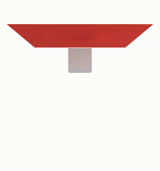

# Hello World

Two quick STARK "hello world" programs — one in Python, one in C++.
Both simulate a piece of cloth falling on a rigid box that spins in place.

<p align="center">
    
</p>

## Python

```python
import numpy as np
import pystark

# 1. Configure output and solver settings
settings = pystark.Settings()
settings.output.simulation_name = "spinning_box_cloth"
settings.output.output_directory = "output_folder"
settings.output.codegen_directory = "codegen_folder"

# 2. Create the simulation
simulation = pystark.Simulation(settings)

# 3. Set global contact parameters
contact_params = pystark.EnergyFrictionalContact.GlobalParams()
contact_params.default_contact_thickness = 0.0025
simulation.interactions().contact().set_global_params(contact_params)

# 4. Add a deformable cloth surface
cV, cT, cH = simulation.presets().deformables().add_surface_grid(
    "cloth",
    size=np.array([0.4, 0.4]),
    subdivisions=np.array([32, 32]),
    params=pystark.Surface.Params.Cotton_Fabric()
)

# 5. Add a rigid body box
bV, bT, bH = simulation.presets().rigidbodies().add_box("box", mass=1.0, size=0.08)
bH.rigidbody.add_translation(np.array([0.0, 0.0, -0.08]))
fix_handler = simulation.rigidbodies().add_constraint_fix(bH.rigidbody)

# 6. Script: spin the box over time
duration = 10.0
def script(t):
    fix_handler.set_transformation(
        np.array([0.0, 0.0, -0.08]),
        90.0*t,
        np.array([0.0, 0.0, 1.0])
    )

# 7. Run
simulation.run(duration, script)
```

## C++

The same scene in C++:

```cpp
#include <stark>

void spinning_box_cloth()
{
    // 1. Configure output and solver settings
    stark::Settings settings;
    settings.output.simulation_name = "spinning_box_cloth";
    settings.output.output_directory = "output_folder";
    settings.output.codegen_directory = "codegen_folder";

    // 2. Create the simulation
    stark::Simulation simulation(settings);

    // 3. Set global contact parameters
    stark::EnergyFrictionalContact::GlobalParams contact_params;
    contact_params.default_contact_thickness = 0.0025;
    simulation.interactions->contact->set_global_params(contact_params);

    // 4. Add a deformable cloth surface
    auto cloth = simulation.presets->deformables->add_surface_grid(
        "cloth",
        Eigen::Vector2d(0.4, 0.4),
        {32, 32},
        stark::Surface::Params::Cotton_Fabric()
    );

    // 5. Add a rigid body box
    auto box = simulation.presets->rigidbodies->add_box("box", 1.0, 0.08);
    box.handler.rigidbody.add_translation({0.0, 0.0, -0.08});
    auto fix = simulation.rigidbodies->add_constraint_fix(box.handler.rigidbody);

    // 6. Script: spin the box
    double duration = 10.0;
    simulation.add_time_event(0.0, duration, [&](double t) {
        fix.set_transformation(
            {0.0, 0.0, -0.08 - 0.1*std::sin(t)}, 
            90.0*t, 
            {0.0, 0.0, 1.0});
    });

    // 7. Run
    simulation.run(duration);
}
```

The C++ and Python APIs are intentionally parallel.
C++ uses direct field access (`simulation.presets->deformables`); Python uses accessor methods (`simulation.presets().deformables()`).
