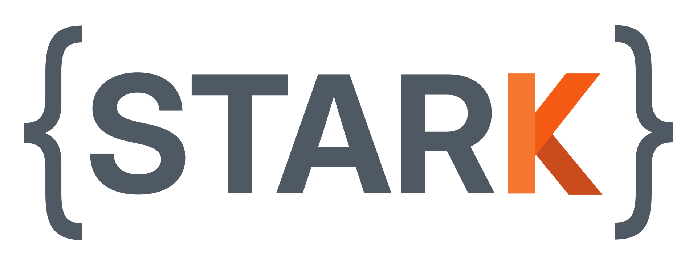

# STARK Documentation

<p align="center">
    
</p>

Welcome to the STARK documentation pages.
STARK is a C++ and Python simulation platform providing robust, state-of-the-art methods for simulating rigid and deformable objects in strongly coupled scenarios.
Check out the [STARK GitHub repo](https://github.com/InteractiveComputerGraphics/stark) and the [STARK ICRA'24 paper](https://www.animation.rwth-aachen.de/publication/0588/).

In this documentation you will find an overview of how STARK works.
As a simulation platform, STARK is relatively large and internally complex.
The purpose of these pages is not to provide an comprehensive description of it all, but rather serve as a high level overview of the main concepts and, most importantly, showcasing how you can use the library to achieve your goals.

Note that STARK is built upon [SymX](https://github.com/InteractiveComputerGraphics/SymX), a mathematical engine that takes care of differentiation, evaluation and the main optimization pipeline.
Based on this, we can see STARK as a **repository** of common simulation models with a convenient interface and extra functionalities such as scripting and a python API.

Finally, depending on you use case, STARK might not be the best solution for you.
Sometimes you need something simpler or more customizable.
If that is the case, maybe it is better for you to use [SymX](https://github.com/InteractiveComputerGraphics/SymX) directly to build your custom solver.
Maybe you need more performance that what STARK offers, for instance a GPU solver.
In that case, STARK might still be helpful for you to test your ideas very quickly in a robust environment before committing to a custom GPU solver.

## Table of Contents

```{toctree}
:caption: Getting Started
:maxdepth: 1

hello_world
setup
architecture
```

```{toctree}
:caption: Core Concepts
:maxdepth: 1

settings
simulation_loop
```

```{toctree}
:caption: Physics Models
:maxdepth: 1

deformables
rigidbodies
rb_constraints
contact
attachments
```

```{toctree}
:caption: High-Level API
:maxdepth: 1

presets
python_api
```

```{toctree}
:caption: Advanced
:maxdepth: 1

extending
```
